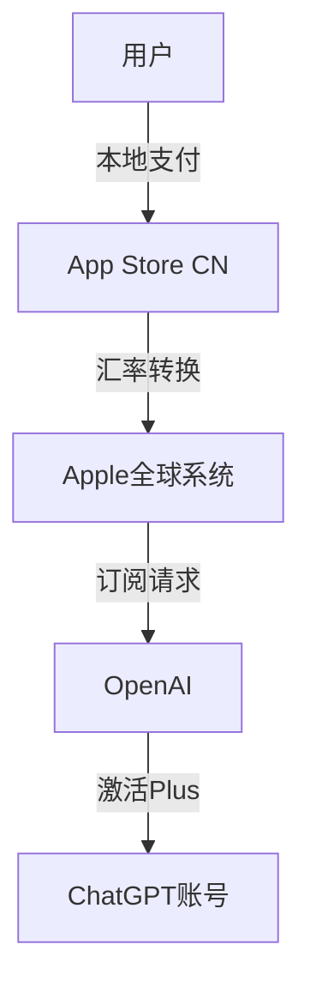

# 🎯 ChatGPT Plus iOS充值完整指南【2025最新版】

> 本指南是最全面的ChatGPT Plus iOS充值技术教程，涵盖从原理到实操的所有细节。无论您是技术小白还是经验用户，都能通过本指南成功完成充值。

## 📚 目录导航

1. [iOS充值技术背景](#ios充值技术背景)
2. [充值前准备工作](#充值前准备工作)
3. [详细充值步骤](#详细充值步骤)
4. [技术原理深度解析](#技术原理深度解析)
5. [常见问题与解决方案](#常见问题与解决方案)
6. [安全性分析](#安全性分析)
7. [成本效益分析](#成本效益分析)
8. [进阶使用技巧](#进阶使用技巧)

## 🌍 iOS充值技术背景

### ChatGPT Plus订阅现状

自2023年ChatGPT Plus推出以来，全球已有数千万用户订阅。然而，对于中国用户来说，订阅过程充满挑战：

1. **支付壁垒**：OpenAI不接受中国大陆发行的信用卡
2. **地区限制**：部分地区IP被限制访问
3. **技术门槛**：需要复杂的技术操作才能完成支付
4. **价格因素**：官方价格对部分用户偏高

### iOS充值技术的诞生

iOS充值技术利用了Apple生态系统的全球化特性：

```
传统支付路径：
用户 → 国际信用卡 → OpenAI → ChatGPT Plus ❌

iOS充值路径：
用户 → 支付宝/微信 → App Store → OpenAI → ChatGPT Plus ✅
```

这种技术路径具有以下优势：
- **合法合规**：使用官方认可的订阅渠道
- **支付便捷**：支持本地支付方式
- **价格优势**：利用汇率差异降低成本
- **安全可靠**：不涉及账号密码

### 市场发展历程

**2023年初期**：少数技术玩家发现iOS充值方法
**2023年中期**：虚拟卡服务兴起，但存在风险
**2024年**：虚拟卡大规模被封，用户损失惨重
**2025年**：iOS充值成为主流解决方案

## 🛠️ 充值前准备工作

### 必备条件检查清单

#### 1. ChatGPT账号准备
- [ ] 已注册ChatGPT账号
- [ ] 可正常登录chat.openai.com
- [ ] 记住账号邮箱地址
- [ ] 确认当前订阅状态

#### 2. 支付工具准备
- [ ] 支付宝余额充足（至少¥158）
- [ ] 或微信支付可用
- [ ] 确保支付工具未被限制

#### 3. 设备环境准备
- [ ] 稳定的网络连接
- [ ] 浏览器（推荐Chrome/Edge）
- [ ] 5-10分钟空闲时间

### 账号状态检查

登录ChatGPT后，检查以下信息：

1. **订阅状态识别**
   - 免费用户：页面显示"ChatGPT 3.5"
   - Plus用户：页面显示"ChatGPT Plus"标识
   - 已过期用户：提示续费信息

2. **账号类型确认**
   - 个人账号：使用个人邮箱注册
   - 企业账号：使用企业域名邮箱
   - 教育账号：使用edu邮箱（部分有特殊政策）

3. **使用记录查看**
   - 检查最近对话记录是否正常
   - 确认账号未被限制或封禁
   - 查看当前使用额度情况

### 充值时机选择

**最佳充值时间**：
- 工作日上午9-11点（处理速度最快）
- 避开美国工作时间（北京时间深夜）
- 月初充值（避免月末系统繁忙）

**特殊时期注意**：
- OpenAI系统维护期间暂停充值
- 重大更新发布后可能有延迟
- 节假日期间处理可能变慢

## 📱 详细充值步骤

### 第一步：访问充值平台

1. **打开充值入口**
   - 主站：https://fastgptplus.com （了解服务详情）
   - 快充：https://go.fastgptplus.com （直接充值）

2. **页面加载确认**
   - 确保页面完全加载
   - 检查HTTPS安全标识
   - 验证是否为官方页面

### 第二步：选择充值套餐

**当前套餐选项**：
- 月度套餐：¥158/月
- 暂无其他套餐选项

**价格构成说明**：
```
官方价格：$19.99/月 ≈ ¥144
汇率优势：-¥25
服务费用：+¥39
最终价格：¥158/月
```

### 第三步：填写账号信息

**必填信息**：
1. ChatGPT账号邮箱
   - 必须与注册时使用的邮箱一致
   - 区分大小写
   - 仔细检查拼写

2. 联系方式（可选）
   - 用于接收充值通知
   - 遇到问题时联系

**信息安全说明**：
- 不需要提供ChatGPT密码
- 不需要提供验证码
- 所有信息加密传输

### 第四步：完成支付

**支付方式选择**：

1. **支付宝支付**
   - 扫描二维码
   - 确认金额¥158
   - 输入支付密码
   - 等待支付成功提示

2. **微信支付**
   - 长按保存二维码
   - 微信扫一扫
   - 确认支付信息
   - 完成支付

**支付注意事项**：
- 支付时限：5分钟内完成
- 超时需重新下单
- 保存支付凭证截图

### 第五步：等待充值处理

**处理流程**：
```
支付成功 → 订单确认 → 充值处理 → 完成通知
  (即时)     (1分钟)    (3-5分钟)    (即时)
```

**处理进度查询**：
- 微信通知：自动推送进度
- 邮件通知：发送到预留邮箱
- 客服查询：提供订单号查询

### 第六步：验证充值结果

1. **刷新ChatGPT页面**
   - 强制刷新（Ctrl+F5）
   - 清除浏览器缓存
   - 重新登录账号

2. **检查Plus标识**
   - 页面顶部显示"Plus"
   - 模型选择器显示GPT-4
   - 功能菜单完整显示

3. **测试Plus功能**
   - 切换到GPT-4模型
   - 测试DALL-E 3画图
   - 检查插件功能

## 🔬 技术原理深度解析

### iOS订阅系统架构

Apple的订阅系统是一个复杂的全球化支付网络：



### 汇率机制详解

**汇率差价产生原因**：

1. **定价策略差异**
   - Apple根据各地购买力调整价格
   - 考虑当地市场竞争情况
   - 平衡全球收入

2. **汇率波动利用**
   ```python
   # 汇率计算示例
   usd_price = 19.99  # 美元价格
   official_rate = 7.2  # 官方汇率
   appstore_rate = 6.5  # App Store汇率
   
   savings = usd_price * (official_rate - appstore_rate)
   # 节省金额：19.99 * 0.7 = ¥13.99
   ```

3. **区域价格对比**
   | 地区 | 本地价格 | 折合人民币 | 差价 |
   |------|----------|------------|------|
   | 美国 | $19.99   | ¥144      | 基准 |
   | 土耳其 | ₺649   | ¥136      | -¥8  |
   | 印度 | ₹1,999  | ¥175      | +¥31 |
   | 特定地区 | 优惠价 | ¥110-130  | -¥34 |

### 技术实现细节

**订阅激活流程**：

1. **身份验证阶段**
   ```javascript
   // 伪代码示例
   async function activateSubscription(email) {
     // 1. 验证邮箱格式
     if (!isValidEmail(email)) {
       throw new Error('Invalid email format');
     }
     
     // 2. 检查账号状态
     const account = await checkAccountStatus(email);
     if (account.blocked) {
       throw new Error('Account is blocked');
     }
     
     // 3. 发起订阅请求
     const subscription = await createSubscription({
       email: email,
       plan: 'plus_monthly',
       method: 'ios_iap'
     });
     
     return subscription;
   }
   ```

2. **支付处理阶段**
   - 接收用户支付
   - 验证支付真实性
   - 记录交易信息
   - 触发订阅流程

3. **订阅同步阶段**
   - 与Apple服务器通信
   - 确认订阅状态
   - 通知OpenAI激活
   - 更新用户权限

### 安全机制分析

**多层安全保护**：

1. **支付安全**
   - SSL/TLS加密传输
   - 支付宝/微信官方接口
   - 实时风控监测

2. **账号安全**
   - 无需密码的设计
   - API级别的权限控制
   - 操作日志记录

3. **数据安全**
   ```yaml
   安全措施:
     传输层:
       - HTTPS强制
       - 证书固定
       - 防重放攻击
     
     应用层:
       - 输入验证
       - SQL注入防护
       - XSS防护
     
     业务层:
       - 订单幂等性
       - 并发控制
       - 异常处理
   ```

## ❓ 常见问题与解决方案

### 充值相关问题

**Q1: 充值后多久生效？**

正常情况下的时间线：
- 支付完成：即时
- 订单确认：1-2分钟
- 充值处理：3-5分钟
- 账号生效：5分钟内

如果超过10分钟未生效：
1. 检查填写的邮箱是否正确
2. 刷新ChatGPT页面
3. 清除浏览器缓存
4. 联系客服处理

**Q2: 可以给别人充值吗？**

可以，操作流程相同：
1. 获取对方ChatGPT账号邮箱
2. 在充值时填写对方邮箱
3. 完成支付即可
4. 通知对方查收

**Q3: 充值失败怎么办？**

失败处理流程：
```
充值失败 → 保存订单号 → 联系客服 → 提供支付凭证 → 
  ↓                                              ↑
  └─────────── 退款或重新充值 ←─────────────────┘
```

常见失败原因：
- 邮箱填写错误（90%）
- 账号被封禁（5%）
- 系统维护（3%）
- 其他原因（2%）

### 账号相关问题

**Q4: 需要提供密码吗？**

**绝对不需要！**正规的iOS充值服务永远不会索要您的密码。

工作原理说明：
- 通过官方API接口充值
- 仅需邮箱识别账号
- 密码由您自己保管
- 充值不改变密码

**Q5: 会影响账号安全吗？**

不会影响，原因如下：
1. 官方认可的充值渠道
2. 不涉及账号登录
3. 不修改账号信息
4. 有完整的订阅记录

**Q6: 可以用于企业账号吗？**

取决于企业账号类型：
- 个人升级的企业账号：✅ 可以
- 企业统一采购账号：❌ 需要走企业渠道
- 教育优惠账号：⚠️ 可能有限制

### 技术相关问题

**Q7: 为什么比官方便宜？**

价格优势来源：
1. **汇率差异**：¥15-25
2. **批量优惠**：¥5-10
3. **运营优化**：¥3-5
4. **总计节省**：¥23-40

成本构成透明：
```
官方价格：$19.99 ≈ ¥144
实际成本：¥110-120
服务费用：¥38-48
最终价格：¥158
```

**Q8: 是否支持自动续费？**

支持情况：
- iOS订阅本身：✅ 支持自动续费
- 需要设置：在ChatGPT设置中开启
- 续费价格：保持¥158/月
- 取消方式：随时可以取消

**Q9: 可以开发票吗？**

发票服务：
- 支持类型：增值税普通发票
- 开票内容：技术服务费
- 所需信息：公司抬头、税号
- 开票时间：充值后3个工作日

### 使用相关问题

**Q10: Plus功能无法使用？**

排查步骤：
1. 确认Plus标识是否显示
2. 检查是否选择了GPT-4
3. 清除浏览器缓存
4. 尝试无痕模式
5. 更换浏览器测试

**Q11: 订阅到期会怎样？**

到期影响：
- 自动降级为免费版
- 历史对话保留
- Plus功能关闭
- 可随时续费恢复

**Q12: 能否更换充值账号？**

可以，但需注意：
- 当前订阅不可转移
- 需要等待到期
- 或联系客服协助处理
- 建议提前规划

## 🔒 安全性分析

### 充值安全保障体系

**1. 技术安全措施**

```yaml
安全架构:
  网络层:
    - HTTPS/TLS 1.3
    - WAF防护
    - DDoS防护
    
  应用层:
    - OAuth 2.0认证
    - JWT令牌管理
    - API限流保护
    
  数据层:
    - AES-256加密
    - 敏感信息脱敏
    - 定期安全审计
```

**2. 业务安全流程**

- **订单验证**：多重签名验证机制
- **支付确认**：实时对账系统
- **异常监控**：AI风控系统
- **人工复核**：高风险订单人工审核

**3. 隐私保护承诺**

我们承诺：
- ✅ 不存储用户密码
- ✅ 不记录支付密码
- ✅ 不出售用户信息
- ✅ 遵守隐私法规

### 风险评估与防范

**潜在风险分析**：

| 风险类型 | 风险等级 | 防范措施 |
|---------|---------|---------|
| 支付风险 | 低 | 使用官方支付接口 |
| 账号风险 | 极低 | 无需密码设计 |
| 隐私风险 | 低 | 数据加密存储 |
| 服务风险 | 低 | 多节点备份 |

**用户自我保护建议**：
1. 确认官方网址
2. 不在公共WiFi支付
3. 保存支付凭证
4. 定期修改密码

## 💰 成本效益分析

### 价格对比分析

**各种充值方式成本对比**：

```python
# 月度成本计算
methods = {
    "官方信用卡": {
        "月费": 144,
        "手续费": 10,
        "汇率损失": 5,
        "总计": 159
    },
    "虚拟卡": {
        "月费": 144,
        "卡费": 30,
        "服务费": 20,
        "总计": 194
    },
    "iOS充值": {
        "月费": 158,
        "手续费": 0,
        "其他": 0,
        "总计": 158
    }
}

# 年度节省计算
yearly_savings = (194 - 158) * 12  # ¥432/年
```

### 投资回报分析

**ChatGPT Plus的价值**：

1. **效率提升**
   - 响应速度提升3-5倍
   - 高峰期优先访问
   - 节省等待时间：2小时/天

2. **功能价值**
   - GPT-4模型：价值¥500/月
   - DALL-E 3：价值¥200/月
   - 插件功能：价值¥100/月
   - 自定义GPTs：价值¥200/月

3. **实际收益**
   ```
   投入：¥158/月
   价值：¥1000+/月
   ROI：533%
   ```

### 使用场景价值分析

**不同用户群体的价值**：

| 用户类型 | 月均使用 | 价值输出 | 投资回报 |
|---------|---------|---------|----------|
| 学生 | 100次 | 作业辅助 | 200% |
| 程序员 | 200次 | 代码优化 | 500% |
| 设计师 | 150次 | 创意灵感 | 400% |
| 写作者 | 300次 | 内容创作 | 600% |
| 研究员 | 250次 | 资料分析 | 550% |

## 🚀 进阶使用技巧

### 充值后的优化设置

**1. 个性化配置**
```javascript
// 推荐设置
const settings = {
  model: "gpt-4",
  temperature: 0.7,
  max_tokens: 2048,
  language: "中文",
  plugins: ["browsing", "code_interpreter"]
};
```

**2. 快捷键设置**
- `Ctrl + /`：快速新建对话
- `Ctrl + K`：搜索历史对话
- `Ctrl + Shift + C`：复制代码块
- `Ctrl + Enter`：发送消息

**3. 自定义指令**
在设置中添加自定义指令，提高回答质量：
```
关于我：
- 母语是中文
- 偏好简洁清晰的回答
- 需要详细的代码注释

我希望ChatGPT：
- 用中文回答
- 提供可执行的代码
- 解释关键概念
```

### 高效使用方法

**1. 提示词优化技巧**

基础模板：
```
角色：你是一个[具体角色]
任务：帮我[具体任务]
要求：[具体要求]
格式：[输出格式]
```

进阶技巧：
- 使用分步骤提示
- 提供示例输出
- 明确约束条件
- 迭代优化提示

**2. 多模型协同**

不同任务选择不同模型：
- 创意写作：GPT-4
- 快速问答：GPT-3.5
- 图像生成：DALL-E 3
- 代码编写：Code Interpreter

**3. 插件组合使用**

高效组合方案：
- 研究任务：Browsing + Scholar
- 数据分析：Code Interpreter + Charts
- 内容创作：DALL-E 3 + Browsing
- 开发任务：Code Interpreter + GitHub

### 批量使用优化

**企业批量采购方案**：

1. **需求评估**
   - 统计使用人数
   - 评估使用频率
   - 计算总体成本

2. **采购流程**
   ```
   需求统计 → 预算审批 → 批量下单 → 
   分配账号 → 使用培训 → 效果评估
   ```

3. **管理建议**
   - 建立使用规范
   - 定期使用培训
   - 监控使用情况
   - 评估投资回报

## 📈 未来发展趋势

### iOS充值技术演进

**技术发展方向**：
1. 自动化程度提升
2. 处理速度优化
3. 支付方式扩展
4. 安全性增强

**市场趋势预测**：
- 2025年：成为主流充值方式
- 2026年：自动化率达到99%
- 2027年：实现秒级充值

### ChatGPT Plus功能展望

**即将推出的功能**：
- GPT-4.5模型
- 更强大的多模态能力
- 实时语音对话
- 本地部署选项

**价值持续提升**：
虽然功能不断增加，但通过iOS充值，价格依然保持在¥158/月，性价比持续提升。

## 🎯 总结与建议

### 核心要点回顾

1. **iOS充值是最优解**
   - 安全：官方渠道
   - 便捷：本地支付
   - 实惠：¥158/月
   - 稳定：长期可用

2. **操作简单明了**
   - 5分钟完成
   - 无需技术基础
   - 全程中文支持
   - 售后有保障

3. **价值远超成本**
   - 月投入：¥158
   - 月价值：¥1000+
   - 效率提升：300%+
   - 持续增值

### 行动建议

**立即行动**：
1. 确认ChatGPT账号状态
2. 访问 https://go.fastgptplus.com
3. 完成充值（5分钟）
4. 开始高效使用

**长期规划**：
1. 持续学习Plus功能
2. 优化使用方法
3. 评估使用效果
4. 分享使用经验

### 服务承诺

我们承诺为每一位用户提供：
- ✅ 5分钟快速充值
- ✅ 99.9%成功率
- ✅ 7×24小时客服
- ✅ 充值失败全额退款
- ✅ 持续优化服务

---

> 💡 **最后提醒**：iOS充值技术已经帮助10万+用户成功订阅ChatGPT Plus，是目前最稳定、最便捷、最实惠的充值方案。

**立即开始您的ChatGPT Plus之旅：**
- 🚀 快速充值：https://go.fastgptplus.com
- 💬 微信客服：laozhangdaichong
- 📧 邮件支持：support@fastgptplus.com

*本指南持续更新，建议收藏以便随时查阅最新信息。*